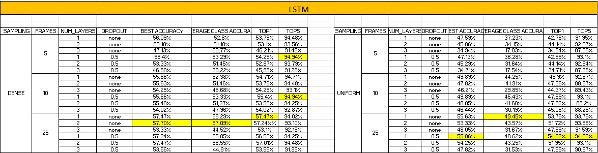

# Multimodal Egocentric Action Recognition project for Advanced Machine Learning Course at Politecnico di Torino 

## Authors: 
Arturo Adelfio, Laura Amoroso, Giorgio Cacopardi

__Date__: 14-06-2024

## Goal 
This project tackles the challenge of recognizing actions performed from a first-person perspective. We achieve this using  Multimodal Egocentric Action Recognition techniques, which leverage data from multiple sources to improve accuracy.
We explore two popular datasets, EpicKitchens and ActionSense, that capture everyday activities in a kitchen environment. Our approach utilizes existing action recognition models, such as I3D, trained on large video datasets as a backbone to extract meaningful features, to then pass to different classifiers to test their performances. 
A key aspect of our project is the use of multimodal data, including visual information from RGB cameras and electrical muscle activity data from electromyography (EMG) sensors that received a minor attention in the literature. We demonstrated how to achieve a performance improvement by coupling the RGB data with the EMG ones.

## How to execute the code

In the run guide notebook there is the workflow of our project, and for each step there is the script to run the corresponding code.

### Features extraction

For extracting the RGB features both of Epic Kitchen and ActionSense the images extrapolated from the video are needed; because of that we just reported the script that we ran locally on our machines. The features extracted are saved in *saved_features_ek* and *saved_features_an* folders. 

### Training a model

In order to train a model the *train_classifier_\** files were created; the parameters and other configurations can be found at the *configs* folder. Here an example taken from the run_guide.ipynb:

```python
%%bash

python3 train_classifier_ek.py name=model_name \
  config=configs/default.yaml \
  train.num_frames_per_clip.RGB=25 \
  train.dense_sampling.RGB=False \
  models.RGB.model=MLP_aggregation_classifier
```
In some scripts of the run guide other parameters are specified in order to make different experiments trying values different from the default ones.

### Structure of the repository

__action-net__: it contains the annotations to divide the ActionSense data into train and test, and other information about timestamps etc. It also contains a notebook to visualize the spectrograms. 

__an\_annotations__: it contains the different annotations files needed for the training of the unimodal models (EMG, RGB) and of the multimodal part. The annotations of the RGB and mulitmodal model are the same and share the same folders (an_anntoations_multimodal_*)

__EMG__: this folder contains the necessary code to preprocess the signals, to produce their spectrogram representation and the data of the different subjects. It also contains the emg data extracted but not yet formatted as the classifier expects, that we produced in our first experiments. To then align with the formatting of the train_classifier code but to not change our previous code we used the functions contained in *action_net_features_formatting.ipynb* .

__images__: some of the plots and architectures of the model used for our final paper.

__mid\_level\_features__: it contains the already extracted fetaures from both the models in order to then feed them to the midlevel fusion classifier.

__models__: in this folder there are all the proposed models for both the datasets. Each file is named after the model it contains.

__pretrained\_i3d__: it contains the weights for the pretrained I3D models.

__saved\_features*__: in these folders we put the features ready to be passed to the model and 
coming from different configurations of the experiments (number of frames, type of sampling etc.).

__saved\_models__: it containes the weights of the trained models used to then resume them for the multimodal classifier.

__tasks__: it contains a wrapper class to define common methods to the classifiers in order to ease the training process. 

__train\_val__: contains the annotations file for the epic kitchen dataset.

__utils__: it contains some utility functions like the loaders, and the classes that define the records for Epic Kitchen and ActionSense, with their attributes. 

__save\_feat*__: these files are employed in order to extract the features learnt by different models (I3D, and the EMG and RGB ones for the midlevel fusion in ActionSense). 

__train\_classifier*__: these files follow the same structure to train and validate a model, but they differ mainly in the loaders used and the parameters passed to the models. 

__plotter__: it is a notebook used to plot the high dimensional features into a 2D space using the TSNE method. 

## Results

The full results of our experiments are contained in the **full_results.xlsx** file. The results are organized through different sheets, according to the task the models are fulfilling, and in tables like this one:


